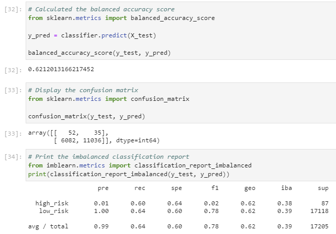
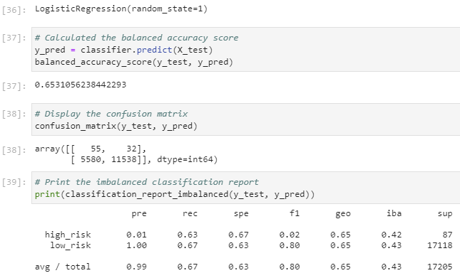
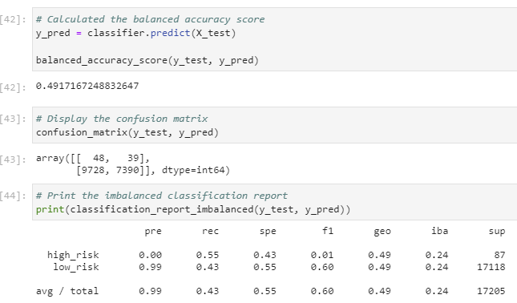
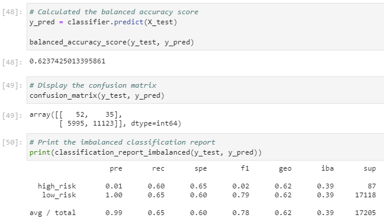
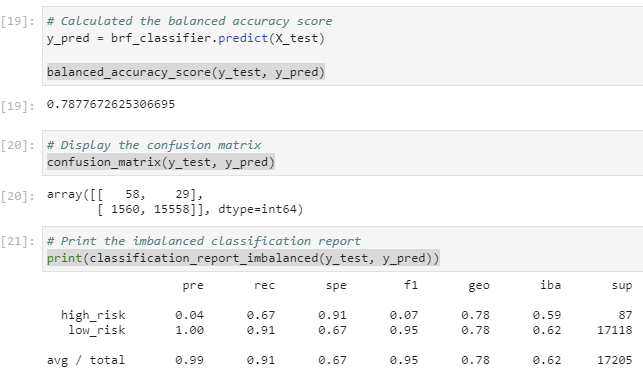
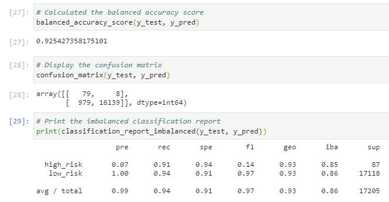

# Credit_Risk_Analysis
Credit risk analysis by using imbalanced-learn and scikit-learn libraries to build and evaluate machine learning models.

## Overview
Credit risk analysis was performed by machine learning models built using imbalanced-learn and scikit-learn libraries. Analysis aims to demonstrate the effectiveness of machine learning models in the following steps:
1. Oversample data with the `RandomOverSampler` and `SMOTE` algorithms
2. Undersample the data with `ClusterCentroids` algorithm
3. Combine over- and undersampling methods with `SMOTEENN` algorithm.
4. Compare `BalancedRandomForestClassifier` and `EasyEnsembleClassifier` machine learning models that reduce bias to predict credit risk.

## Results

* Naive Random Oversampling with `RandomOverSampler` algorithm: 
 

  * Balanced Accuracy Score: 0.62
  * Scores on high risk credit prediction:
    - Precision: 0.01
    - Sensitivity(Recall): 0.60
    - F1 harmonic: 0.02
    - Predicted as True High Risk: 52
    - Predicted as False High Risk: 35
  * Scores on low risk credit prediction:
    - Precision: 1.0
    - Sensitivity(Recall): 0.64
    - F1 harmonic: 0.78
    - Predicted as False Low Risk: 6082
    - Predicted as True Low Risk: 11036

* SMOTE Oversampling: 
 

  * Balanced Accuracy Score: 0.65
  * Scores on high risk credit prediction:
    - Precision: 0.01
    - Sensitivity(Recall): 0.63
    - F1 harmonic: 0.02
    - Predicted as True High Risk: 55
    - Predicted as False High Risk: 32
  * Scores on low risk credit prediction:
    - Precision: 1.0
    - Sensitivity(Recall): 0.67
    - F1 harmonic: 0.80
    - Predicted as False Low Risk: 5580
    - Predicted True Low Risk: 11538

* Undersampling with `ClusterCentroids` algorithm: 

  * Balanced Accuracy Score: 0.49
  * Scores on high risk credit prediction:
    - Precision: 0.00
    - Sensitivity(Recall): 0.55
    - F1 harmonic: 0.01
    - Predicted as True High Risk: 48
    - Predicted as False High Risk: 39
  * Scores on low risk credit prediction:
    - Precision: 0.99
    - Sensitivity(Recall): 0.43
    - F1 harmonic: 0.60
    - Predicted as False Low Risk: 9728
    - Predicted True Low Risk: 7390

* Combination Sampling with `SMOTEENN` algorithm: 
 

  * Balanced Accuracy Score: 0.62
  * Scores on high risk credit prediction:
    - Precision: 0.01
    - Sensitivity(Recall): 0.60
    - F1 harmonic: 0.02
    - Predicted as True High Risk: 52
    - Predicted as False High Risk: 32
  * Scores on low risk credit prediction:
    - Precision: 1.00
    - Sensitivity(Recall): 0.65
    - F1 harmonic: 0.79
    - Predicted as False Low Risk: 5995
    - Predicted True Low Risk: 11123

* Balanced Random Forest Classifier with `BalancedRandomForestClassifier` alorithm: 
 

  * Balanced Accuracy Score: 0.79
  * Scores on high risk credit prediction:
    - Precision: 0.04
    - Sensitivity(Recall): 0.67
    - F1 harmonic: 0.07
    - Predicted as True High Risk: 58
    - Predicted as False High Risk: 29
  * Scores on low risk credit prediction:
    - Precision: 1.00
    - Sensitivity(Recall): 0.91
    - F1 harmonic: 0.95
    - Predicted as False Low Risk: 1560
    - Predicted True Low Risk: 15558

* Easy Ensemble Classifier with `EasyEnsembleClassifier` algorithm: 
 

  * Balanced Accuracy Score: 0.92
  * Scores on high risk credit prediction:
    - Precision: 0.07
    - Sensitivity(Recall): 0.91
    - F1 harmonic: 0.14
    - Predicted as True High Risk: 79
    - Predicted as False High Risk: 8
  * Scores on low risk credit prediction:
    - Precision: 1.00
    - Sensitivity(Recall): 0.94
    - F1 harmonic: 0.97
    - Predicted as False Low Risk: 979
    - Predicted True Low Risk: 16139

## Summary

Results demonstrate that none of the of the oversampling, undersampling, or combined resampling methods provided convincing evidence of their effectiveness for the logistic regression models.

The comparison `BalancedRandomForestClassifier` and `EasyEnsembleClassifier` provided more convincing results. Overall, the metrics `EasyEnsembleClassifier` appear most suitable for credit risk analysis due to its high balanced accuracy score, high sensitivity in predicting high risk credits, and high precision as well as sensitivity in predicting low risk credits. The confusion matrix of `EasyEnsembleClassifier` also provides more promising ensemble logistic regression. Namely, `EasyEnsembleClassifier` made the least mistakes in identifying high risk and low risk credits, as demonstared in the confusion matrix.

There is, however, a cause for concern in the metrics of `EasyEnsembleClassifier`. The imbalanced classification report, particularly on low risk credits, suggests overfitting of the model, which may result in poor generalization.
